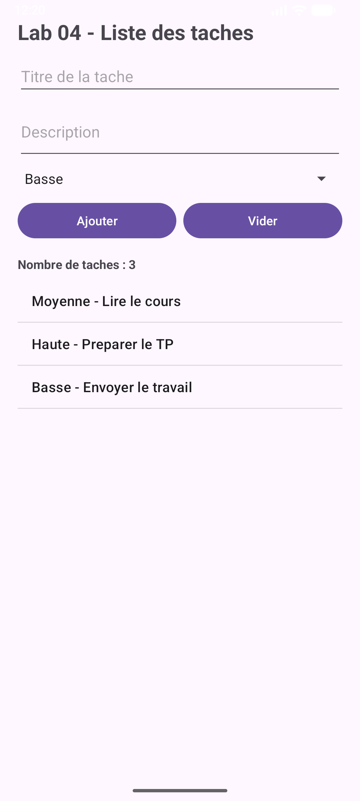
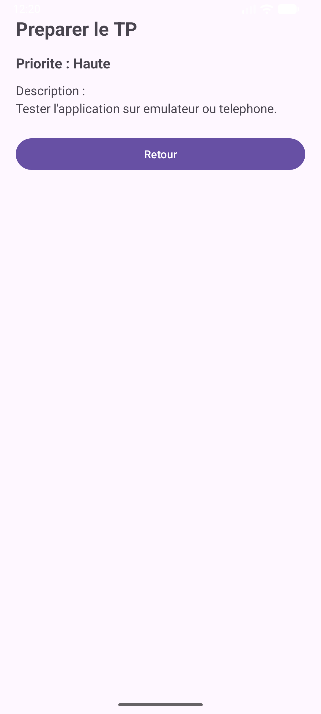

# Android Lab 04

Lab 04 is a simple Android task list application built with Java and XML layouts.

The goal of this lab is to practice working with form inputs, a spinner, a dynamic `ListView`, and navigation between two activities using `Intent` extras.

## Screenshots

### Main screen



### Task details screen



## What The App Does

- Shows a list of starter tasks when the app opens.
- Lets the user enter a task title and description.
- Lets the user choose a priority: `Basse`, `Moyenne`, or `Haute`.
- Adds the new task to the list.
- Updates the task counter after each add or delete action.
- Opens a second screen when the user taps a task.
- Shows the selected task title, priority, and description on the detail screen.
- Deletes a task when the user long-presses it.

## Project Structure

```text
Lab04/
  app/
    src/
      main/
        java/com/example/lab04/
          MainActivity.java
          Screen2Activity.java
        res/layout/
          activity_main.xml
          activity_screen2.xml
        res/values/
          strings.xml
```

## Main Files

`MainActivity.java`

Handles the main screen. It reads values from the inputs, adds tasks to an `ArrayList`, refreshes the `ListView`, opens the detail screen, and deletes tasks with a long press.

`Screen2Activity.java`

Receives the selected task using `Intent` extras and displays its details.

`activity_main.xml`

Contains the task form, priority spinner, buttons, counter, and list.

`activity_screen2.xml`

Contains the detail view for one selected task.

## How To Run

Open the `Lab04` folder in Android Studio, wait for Gradle sync, then run the app on an emulator or Android phone.

You can also build it from PowerShell:

```powershell
cd "C:\Users\User\Documents\Web and mobile 2\android-cert\Lab04"
.\gradlew.bat assembleDebug
```

To install it on a connected emulator or phone:

```powershell
.\gradlew.bat installDebug
```

## Manual Test

1. Open the app.
2. Confirm that three starter tasks are displayed.
3. Enter a task title.
4. Enter a task description.
5. Select a priority.
6. Press `Ajouter`.
7. Confirm that the new task appears in the list.
8. Confirm that the task counter increases.
9. Tap a task.
10. Confirm that the detail screen opens with the correct title, priority, and description.
11. Press `Retour`.
12. Long-press a task.
13. Confirm that the task is removed and the counter decreases.
14. Try pressing `Ajouter` with an empty title.
15. Confirm that an error message appears.

## Verification

The project was verified with:

```powershell
.\gradlew.bat assembleDebug
```

Result:

```text
BUILD SUCCESSFUL
```
